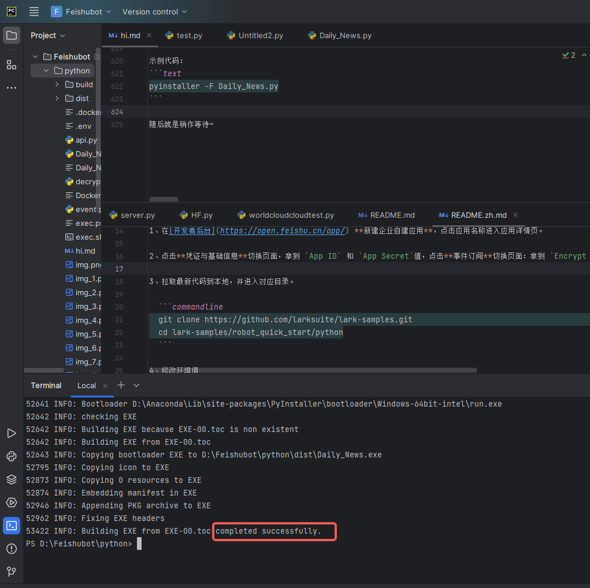
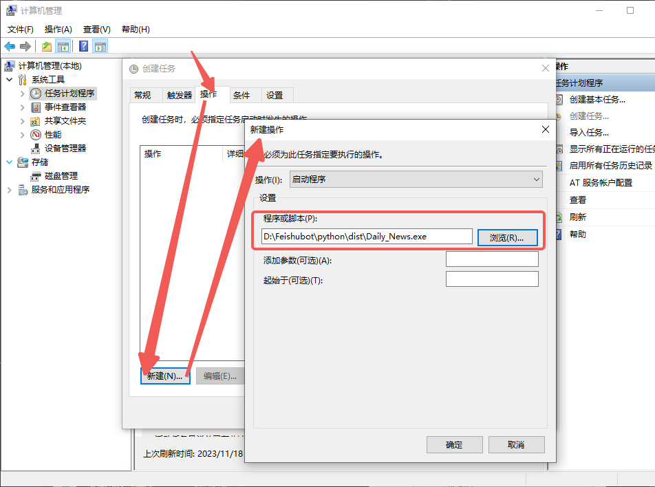

[//]: # (# 从0开始！如何整出自己的飞书财经新闻小助手)
<br>


> ⚠️ 本教程仅作学习分享用途，该案例中使用爬虫工具抓取了东方财富网的部分页面与信息，仅为单次爬取供演示，实际实践中请注意请求频率，谨慎使用`while`与`for`循环，建议保持**3秒/次**的访问速率。

本示例介绍了如何将飞书BOT与Python爬虫(Requests)结合，在打包`.py`程序为`.exe`可执行文件后通过Windows定时执行功能，实现飞书机器人能在飞书群聊中定时发送**东方财富-证券聚焦-网友点击排行榜**最新的10条新闻。

链接：[东方财富-证券聚焦-网友点击排行榜](https://finance.eastmoney.com/a/czqyw.html)

具体位置：

实现结果：


<br>

-----------
<br>

## 运行环境

- Python 3 / Pycharm / Anaconda 3
- Edge / Chrome

<br>

-----------
<br>

## 涉及语言

- **Python** (编写涉及)
- **Html**  (数据涉及)
- **Json**  (数据涉及)

<br>

-----------

&nbsp;
## 开发流程
<br>

### ① 钻研数据来源、做好爬虫准备

首先打开我们的浏览器，点击输入框，来到我们亲爱的 [东方财富-证券聚焦-网友点击排行榜](https://finance.eastmoney.com/a/czqyw.html) 页面。

  ```commandline
  https://finance.eastmoney.com/a/czqyw.html
  ```

点击键盘上的 `F12` ，查看是否跳出如下窗口，若未跳出可能是未开启Fn锁，则需要按住键盘上的 `Fn + F12` 以打开该窗口。<br>
_（~~你可能不经意间打开过还觉得很高级~~）_


随后让我们把目光聚焦到上半部分，花花绿绿的这些能通过上述方法打开的英文字母合集，我们称之为**html语言**。这些个html代码就是对应这个网页上所有的内容，根据这个关系，我们就可以通过连连看的方法找到我们所需要的东西了，点击箭头所指：<br>
没错！就是他 <br>
此时我们将视角转回网页区域，看看咱想爬取哪一部分的数据？是了，是咱的**网友点击排行榜**，将鼠标移动到箭头所指位置，并单击一次鼠标左键：

_~~（因为除了这个是静态的之外其他都不能直接用上边的url去爬，以后有机会讲讲动态怎么结合着整）~~_


我去！好神奇！**右边**的代码居然跟着动了。没错，这个就是**网页元素检查**，如果你将鼠标在右侧代码上移动，可能你会发现页面中的某一部分被蓝色半透明矩形所覆盖，而这就是一个个元素，网页中的**文字、图片、横线**都是元素，右边这些html代码被显示为一个个元素，合在一起便组成了整个网页。


<br>

### ② 基底代码与原理以及元素选取

现在你发现了我们究竟是在寻找什么，让我们暂停一下浏览器这边的进程，打开Pycharm：<br>

然后新建一个`Daily_News.py`文件，最好是在一个**船新的路径**下，无需额外更改或设置。（你要不会新建最好[百度](https://www.baidu.com)一下）

面对着如此空的代码页，我建议你先写下：

```text
a = 1 + 1
print(a)
```
好了不打岔。为了能获取到辣个网站的信息，我们首先需要引入我们的`requests`库，通常我们会使用`import（库的名称）`来让当前代码可以调用到该库的相关功能。

* `import`是**导入**的意思、`requests`是**请求**的意思。
* 如果你在运行途中发现某个库你没有安装，可以使用`pip install ***`来安装对应的包，文末会给出代码，可以学习完后去文末附录中复制！

正如你所想的一样！我们在实际中通过浏览器访问网址是通过我们的电脑像那个网址请求目标网址给我们发信息，浏览器就像一个编译器，将html语言翻译成**文字、图片、横线**，让大家都能看得懂。而在Python中使用`requests`库则是实现同样的过程，但是Python并不会直接将其编译出来，如下所示：

  ```text
  import requests
  
  # 所要请求的网址
  url = 'https://finance.eastmoney.com/a/czqyw.html' # 为url赋值(str字符串格式)
  
  # 处理请求部分
  requests_respond = requests.get(url) #执行requests库中的get函数，获取该网址信息，再赋值给requests_respond
  print(requests_respond) # 打印请求所获取到的信息
  ```

哦豁！怎么输出个：

  ```text
  <Response [200]>
  ```

我们来更改一下代码，看看为啥输出个这个玩意儿。`type()`函数是Python中众多无需引入额外库可直接写入代码的函数之一，其功能主要为返回`()`中的所属类型。

  ```text
  import requests
  
  # 所要请求的网址
  url = 'https://finance.eastmoney.com/a/czqyw.html' # 为url赋值(str字符串格式)
  
  # 处理请求部分
  requests_respond = requests.get(url) #执行requests库中的get函数，获取该网址信息，再返回给requests_respond
  print(requests_respond) # 打印请求所获取到的信息是个啥东西
  ```

这次代码输出：

  ```text
  <class 'requests.models.Response'>
  ```

* `Response`是**回应、响应**的意思。

可能大家都见过404，知道404是怎么个事儿。与404相同，这个属于响应类型的`<Response [200]>`是指此次网络请求返回HTTP状态码（例如`403`、`404`、`500`、`502`），而200则意味着**连接成功**。

_想了解更多网络请求返回HTTP状态码请移步CSDN的[相关文章](https://blog.csdn.net/wy971744839/article/details/130490738)。_

那既然请求成功了，咱的html代码给请到哪里去了？？？这时就要请出来我们的`.text`了，使用它将请求的内容（text）整出来。

  ```text
  import requests
  
  # 所要请求的网址
  url = 'https://finance.eastmoney.com/a/czqyw.html' # 为url赋值(str字符串格式)
  
  # 处理请求部分
  requests_respond = requests.get(url) #执行requests库中的get函数，获取该网址信息，再返回给requests_respond
  requests_respond_text = requests_respond.text
  ```
oi!输出老长一段：

  ```text
  <!DOCTYPE html PUBLIC "-//W3C//DTD XHTML 1.0 Transitional//EN" "http://www.w3.org/TR/xhtml1/DTD/xhtml1-transitional.dtd">
  <!--published at 2023/11/18 2:27:56 by finance.eastmoney.com ZP NEWS 156-->
  <html lang="en">

  ...此处省略703行代码...

  <script type="text/javascript" src="//emcharts.dfcfw.com/usercollect/usercollect.min.js" charset="utf-8"></script>
  ```
遇事先不急，反手掏出`type()`验他身份，

  ```text
  <class 'str'>
  ```
我的妈，这么大一串居然是一整个`str`类型的字符串，那我们该如何在这一串代码中寻找到我们所需要的网友点击排行榜呢？让我们把目光放回到浏览器中，在我们依据之前的操作选中网友点击排行榜的第一条新闻后，发现他处在如下一个**元素结构**中：

  ```text
  <div class="tabList pt5 pb5 bg_sblue clearfix">
            <ul class="h28 fn">
                            <li><span class="no">1</span> <a target="_blank" href="https://finance.eastmoney.com/a/202311172907424344.html">半导体设备制造商正被调查</a></li>
                            <li><span class="no">2</span> <a target="_blank" href="https://finance.eastmoney.com/a/202311172907300654.html">智能网联汽车大消息 准入试点工作开启 概念股名单揭晓</a></li>
                            <li><span class="no">3</span> <a target="_blank" href="https://finance.eastmoney.com/a/202311172907514416.html">深圳正威最大产业园停产 员工放假两个月</a></li>
                            <li><span class="no">4</span> <a target="_blank" href="https://finance.eastmoney.com/a/202311172907411955.html">全球首款！基于开源鸿蒙的人形机器人发布 相关A股机器人概念股午后异动</a></li>
                            <li><span class="no">5</span> <a target="_blank" href="https://finance.eastmoney.com/a/202311172907407885.html">A股三大指数小幅收涨 汽车产业链集体走强</a></li>
                            <li><span class="no">6</span> <a target="_blank" href="https://finance.eastmoney.com/a/202311172907412259.html">HBM概念火了！多家巨头加码入场 一图梳理概念股</a></li>
                            <li><span class="no">7</span> <a target="_blank" href="https://finance.eastmoney.com/a/202311172907438635.html">100分钟预订1万辆！李想“跳楼款”新车开售：60万以内 充电12分钟续航500公里</a></li>
                            <li><span class="no">8</span> <a target="_blank" href="https://finance.eastmoney.com/a/202311172907464385.html">一则大消息 医药股狂飙！盘面多点开花 医药相关板块表现亮眼</a></li>
                            <li><span class="no">9</span> <a target="_blank" href="https://finance.eastmoney.com/a/202311172907303835.html">抖音概念指数领涨两市 多家公司回应相关合作！</a></li>
                            <li><span class="no">10</span> <a target="_blank" href="https://finance.eastmoney.com/a/202311172907387340.html">举行会谈</a></li>
            </ul>
            <div class="clear"></div>
        </div>
    </div>
  ```

现在就很明朗了，不难看出，这段html代码中，`<li><span class="no">textcontent</li>`这种形式中的`textcontent`就是我们苦苦寻找的网友点击排行榜内容。

你可能一脸懵b，想提问是怎么确定出这一段代码的呢？不急，演示一波。<br>

* 如图所示，我们将鼠标向上移动，去寻找元素的合集，寻找是谁框住了我们的十条新闻。

* 鼠标移动，我们不难发现包裹住我们想要爬取的整个部分的元素框框叫做`<ul class="h28 fn">`。但是！可能你的鼠标灵敏度太高，手一滑滑上了一点，一不小心滑到了上边的`<div class="tabList pt5 pb5 bg_sblue clearfix">`处。


* 你会发现，欸？明明这个元素也可以整出个蓝框框框住网友点击排行榜的嘞，为啥不用他？相信聪明的人已经发现了，是的，`<div class="tabList pt5 pb5 bg_sblue clearfix">`相对于`<ul class="h28 fn">`来说，他所包含的信息多了一层，也就是`<ul class="h28 fn">`也被`<div class="tabList pt5 pb5 bg_sblue clearfix">`包裹在其中，这就会造成你在单独拎出来一段元素后还得再抽丝剥茧一次，而选择`<ul class="h28 fn">`，这个作为`<li>`最后一层保护壳的元素则会使得我们的步骤减少到两步。可能还有人不懂，我画个**抽象图**解释一下：


* 如果你理解了，恭喜你！我们现在可以将目光转到**Python**上了。

<br>

### ③ 爬！

现在我们知道我们要找的是`<ul class="h28 fn">`与`<li>`了，那么我们该如何把他从一大坨代码中找出来呢？妹错！我们要使用到`.找()`函数了，sorry，是`.find()`函数，开打开打：

* 强干蛮牛，It's important to underline that 有俩类型的`.find()`函数：
* 一个是`.find()`本体，从头到尾不管有多少个相同的目标寻找元素，只返回最先找到的那一个。
* 而另外一个是`.find_all()`函数，他是个啥呢？他能将全文中所有目标寻找元素全部返回，就相当于查看全部搜索和仅查看单个搜索结果的区别。

好嘞，了解完这些，我们开始**Python大业**：

给前文的`requests_respond_text`上个`.find()`嘴脸：

  ```text
  # 寻寻觅觅我的ul和class="h28 fn"
  first_attempt = requests_respond_text.find('ul', class_ = 'h28 fn')
  ```

果不其然，**报错了**，为啥捏？

  ```text
  Traceback (most recent call last):
    File "D:\Feishubot\python\test.py", line 9, in <module>
      first_attempt = requests_respond_text.find('ul',class_ = 'h28 fn')
                      ^^^^^^^^^^^^^^^^^^^^^^^^^^^^^^^^^^^^^^^^^^^^^^^^^^
  TypeError: str.find() takes no keyword arguments
  ```

需要注意的是，`str`是一个大整体，直接用`.find`去找肯定是不能找的，**他就一个，你还找啥？**
* 这个时候就要请出我们的整理大师`BeautifulSoup`美丽的汤了！其为Python中`bs4`库中的一个**格式整理**函数：
* 它可以让`<li>`、`<ul>`、`<div>`等等拖家带口，让其后面的内容与其绑定，再从一个**巨无霸**，变成一条条单独的**元素**，这样当我们用`.find`去寻找`<li>`的时候，我们就可以直接把他后边的新闻直接拉出来啦~
```text
from bs4 import BeautifulSoup
  
requests_respond_text_ordered = BeautifulSoup(requests_respond.text,"html.parser")
```
 
上述代码中，`"html.parser"`意味着我们告诉这个函数，咱要他整理的是html语言，这样他就能正确的整理好咱的巨无霸。

现在来看看代码全览：

```text
import requests
from bs4 import BeautifulSoup

# 所要请求的网址
url = 'https://finance.eastmoney.com/a/czqyw.html' # 为url赋值(str字符串格式)

# 处理请求部分
requests_respond = requests.get(url) # 执行requests库中的get函数，获取该网址信息，再返回给requests_respond
requests_respond_text = requests_respond.text # 取他文本！
requests_respond_text_ordered = BeautifulSoup(requests_respond.text,"html.parser")
first_attempt = requests_respond_text_ordered.find('ul', class_ = 'h28 fn')
print(first_attempt) # 输出出来看看是不是整成功拉？
print(type(first_attempt)) # 验一下身份
```

返回：

```text
<ul class="h28 fn">
<li><span class="no">1</span> <a href="https://finance.eastmoney.com/a/202311172907424344.html" target="_blank">半导体设备制造商正被调查</a></li>
<li><span class="no">2</span> <a href="https://finance.eastmoney.com/a/202311172907300654.html" target="_blank">智能网联汽车大消息 准入试点工作开启 概念股名单揭晓</a></li>
<li><span class="no">3</span> <a href="https://finance.eastmoney.com/a/202311172907514416.html" target="_blank">深圳正威最大产业园停产 员工放假两个月</a></li>
<li><span class="no">4</span> <a href="https://finance.eastmoney.com/a/202311172907411955.html" target="_blank">全球首款！基于开源鸿蒙的人形机器人发布 相关A股机器人概念股午后异动</a></li>
<li><span class="no">5</span> <a href="https://finance.eastmoney.com/a/202311172907407885.html" target="_blank">A股三大指数小幅收涨 汽车产业链集体走强</a></li>
<li><span class="no">6</span> <a href="https://finance.eastmoney.com/a/202311172907412259.html" target="_blank">HBM概念火了！多家巨头加码入场 一图梳理概念股</a></li>
<li><span class="no">7</span> <a href="https://finance.eastmoney.com/a/202311172907438635.html" target="_blank">100分钟预订1万辆！李想“跳楼款”新车开售：60万以内 充电12分钟续航500公里</a></li>
<li><span class="no">8</span> <a href="https://finance.eastmoney.com/a/202311172907464385.html" target="_blank">一则大消息 医药股狂飙！盘面多点开花 医药相关板块表现亮眼</a></li>
<li><span class="no">9</span> <a href="https://finance.eastmoney.com/a/202311172907303835.html" target="_blank">抖音概念指数领涨两市 多家公司回应相关合作！</a></li>
<li><span class="no">10</span> <a href="https://finance.eastmoney.com/a/202311172907387340.html" target="_blank">举行会谈</a></li>
</ul>
<class 'bs4.element.Tag'>
```
上半部分`<ul>textcontent</ul>`就是咱找出来的网友点击排行榜的内容，而下边的`<class 'bs4.element.Tag'>`就说明上边一大坨是啥，obviously，是`bs4`中的一种**元素文本合集**类型。

* _由于这段数据量较小，我们在此就不提及`.find_all()`的用法，有兴趣的UU可以私me_

对于这段不知道怎么操作的文本类型，我们直接采用str大法，将其**字符串**化，`str()`，启动！

```text
rough_text = str(first_attempt)
print(rough_text)
```

输出如下结果：

```text
<ul class="h28 fn">
<li><span class="no">1</span> <a href="https://finance.eastmoney.com/a/202311172907424344.html" target="_blank">半导体设备制造商正被调查</a></li>
<li><span class="no">2</span> <a href="https://finance.eastmoney.com/a/202311172907514416.html" target="_blank">深圳正威最大产业园停产 员工放假两个月</a></li>
<li><span class="no">3</span> <a href="https://finance.eastmoney.com/a/202311172907411955.html" target="_blank">全球首款！基于开源鸿蒙的人形机器人发布 相关A股机器人概念股午后异动</a></li>
<li><span class="no">4</span> <a href="https://finance.eastmoney.com/a/202311172907407885.html" target="_blank">A股三大指数小幅收涨 汽车产业链集体走强</a></li>
<li><span class="no">5</span> <a href="https://finance.eastmoney.com/a/202311172907412259.html" target="_blank">HBM概念火了！多家巨头加码入场 一图梳理概念股</a></li>
<li><span class="no">6</span> <a href="https://finance.eastmoney.com/a/202311172907438635.html" target="_blank">100分钟预订1万辆！李想“跳楼款”新车开售：60万以内 充电12分钟续航500公里</a></li>
<li><span class="no">7</span> <a href="https://finance.eastmoney.com/a/202311172907464385.html" target="_blank">一则大消息 医药股狂飙！盘面多点开花 医药相关板块表现亮眼</a></li>
<li><span class="no">8</span> <a href="https://finance.eastmoney.com/a/202311172907387340.html" target="_blank">举行会谈</a></li>
<li><span class="no">9</span> <a href="https://finance.eastmoney.com/a/202311172907602732.html" target="_blank">证监会：严厉打击以衍生品为“通道”规避证券期货市场监管的行为</a></li>
<li><span class="no">10</span> <a href="https://finance.eastmoney.com/a/202311172907596212.html" target="_blank">三部门：一视同仁满足不同所有制房地产企业合理融资需求</a></li>
</ul>
```
虽然和上面一模一样，但是他现在已经是一个平平无奇的文本拉！随后我们要引入一个船新的函数`.split()`。
* `split`是**分割**的意思。

正如这个意思一般，`.split`可以通过识别`()`中内容并将其作为裁剪点，我们将这段话作为示例。
```text
test_text = '正如这个意思一般，.split可以通过识别()中内容并将其作为裁剪点，我们将这段话作为示例。'
print(test_text.split('，'))
```
输出：
```text
['正如这个意思一般', '.split可以通过识别()中内容并将其作为裁剪点', '我们将这段话作为示例。']
```
由上述代码以及结果可见，`.split()`通过识别`test_text`中`()`内的`'，'`，将句子按照逗号分割开了，同时，作为裁剪点的`'，'`并没有再次出现。

回到我们的`rough_text`中，现在你知道了，我们可以通过将其中的`<a href="`作为裁剪点，要注意的是，现在`rough_text`已经是一个纯文本了，其中的`"`已经不再具有特殊意义以及其他作用，所以在分割时也需带上这一部分。
* 同时，当裁剪点含有`"`时，我们可以使用单引号`''`来包裹他。反之，当裁剪点含有`'`时，我们可以使用双引号`""`来包裹他。裁剪点中有什么，包裹的引号就**不能**用什么，不然会引发错误，这条规则在其他Python函数中同样适用。


裁剪过程：
```text
first_split_result = rough_text.split('<a href="')
print(f'这个数列有{len(first_split_result)}个元素。')
```
输出：
```text
['<ul class="h28 fn">\n<li><span class="no">1</span> ', 'https://finance.eastmoney.com/a/202311172907424344.html" target="_blank">半导体设备制造商正被调查</a></li>\n<li><span class="no">2</span> ', 'https://finance.eastmoney.com/a/202311172907514416.html" target="_blank">深圳正威最大产业园停产 员工放假两个月</a></li>\n<li><span class="no">3</span> ', 'https://finance.eastmoney.com/a/202311172907411955.html" target="_blank">全球首款！基于开源鸿蒙的人形机器人发布 相关A股机器人概念股午后异动</a></li>\n<li><span class="no">4</span> ', 'https://finance.eastmoney.com/a/202311172907407885.html" target="_blank">A股三大指数小幅收涨 汽车产业链集体走强</a></li>\n<li><span class="no">5</span> ', 'https://finance.eastmoney.com/a/202311172907412259.html" target="_blank">HBM概念火了！多家巨头加码入场 一图梳理概念股</a></li>\n<li><span class="no">6</span> ', 'https://finance.eastmoney.com/a/202311172907438635.html" target="_blank">100分钟预订1万辆！李想“跳楼款”新车开售：60万以内 充电12分钟续航500公里</a></li>\n<li><span class="no">7</span> ', 'https://finance.eastmoney.com/a/202311172907464385.html" target="_blank">一则大消息 医药股狂飙！盘面多点开花 医药相关板块表现亮眼</a></li>\n<li><span class="no">8</span> ', 'https://finance.eastmoney.com/a/202311172907387340.html" target="_blank">举行会谈</a></li>\n<li><span class="no">9</span> ', 'https://finance.eastmoney.com/a/202311172907602732.html" target="_blank">证监会：严厉打击以衍生品为“通道”规避证券期货市场监管的行为</a></li>\n<li><span class="no">10</span> ', 'https://finance.eastmoney.com/a/202311172907596212.html" target="_blank">三部门：一视同仁满足不同所有制房地产企业合理融资需求</a></li>\n</ul>']
这个数列有11个元素。
```
毕竟是新闻，光凭标题肯定了解不到太多，所以我们需要一并展示网址。

在上文进行分割后，我们可以非常容易看出，在这个数列Array中，除第一个元素外前边半部分就是网址，而每个网址与新闻标题中间隔着的是`" target="_blank">`。但是他总共有**10条新闻**！一个个搞是不可能的，永远都不可能的，so此时，除了要继续使用`.split()`外，我们需要引入`for循环`的概念。
* `for循环`，伟大的作品。

我们先来看一下Python中循环最基本的思想与注意事项：
```text
for i in range(10):  # 结尾要加冒号 range()指输出的次数是多少，为了与示例相同，我们选择与新闻数相同的10
    print(f'This is 第{i+1}次输出，此时i值为{i}')
```
输出：
```text
This is 第1次输出，此时i值为0
This is 第2次输出，此时i值为1
This is 第3次输出，此时i值为2
This is 第4次输出，此时i值为3
This is 第5次输出，此时i值为4
This is 第6次输出，此时i值为5
This is 第7次输出，此时i值为6
This is 第8次输出，此时i值为7
This is 第9次输出，此时i值为8
This is 第10次输出，此时i值为9
```
显而易见，Python的数数是从`0`开始算的，也就是说数`10`次后，`i`为`9`，再举个例子，选取数列中第一个也是用Array[0]实现：
```text
print(first_split_result[0])
```
输出：
```text
<ul class="h28 fn">\n<li><span class="no">1</span> 
```
所以依据这个原理，我们可以借助`for循环`依次读取`first_split_result`11个元素中的那第2~11的真正含有有效信息的元素。

因为其实`first_split_result[1]~first_split_result[10]`（也就是第2~11个元素）的形式都一模一样，我们先对单个进行分析：

```text
# 第二条内容
single_news = 'https://finance.eastmoney.com/a/202311172907424344.html" target="_blank">半导体设备制造商正被调查</a></li>\n<li><span class="no">2</span> '
```
我们不难发现两个裁剪点，新闻网址和新闻标题之间的`" target="_blank">`与新闻标题和无内容的尾巴之间的`</a>`。

统合上文的`Array[0]`与`.split()`方法，我们写出如下代码：

```text
single_news = 'https://finance.eastmoney.com/a/202311172907424344.html" target="_blank">半导体设备制造商正被调查</a></li>\n<li><span class="no">2</span> '

# 第一次分割" target="_blank">，得到含有单独的新闻链接+新闻标题和小尾巴的长度为2的数列。
single_news_split_results = single_news.split('" target="_blank">')

# 新闻链接赋值 single_news_split_results中的第一个元素就是新闻url
single_news_url = single_news_split_results[0]

# 拆分标题与小尾巴 从single_news_split_results中的第二个元素就是新闻标题加小尾巴 将</a>作为裁剪点 得出的结果数列中第一个就是新闻标题
rough_header = single_news_split_results[1].split('</a>')
single_news_header = rough_header[0]

# 预览上述结果
print(single_news_split_results)
print(single_news_url)
print(rough_header)
print(single_news_header)
```
输出：
```text
['https://finance.eastmoney.com/a/202311172907424344.html', '半导体设备制造商正被调查</a></li>\n<li><span class="no">2</span> ']
https://finance.eastmoney.com/a/202311172907424344.html
['半导体设备制造商正被调查', '</li>\n<li><span class="no">2</span> ']
半导体设备制造商正被调查
```
**Perfecto!!!** 随后添加循环，叶问附身，我要整10个！
```text
Greetings = "今日事，今日报，黄大炮带你看速报：\n"
for i in range(10):  # 咱就10个新闻
    single_news = first_split_result[i+1]  # 咱新闻从第二个元素才开始！

    # 第一次分割" target="_blank">，得到含有单独的新闻链接+新闻标题和小尾巴的长度为2的数列。
    single_news_split_results = single_news.split('" target="_blank">')
    
    # 新闻链接赋值 single_news_split_results中的第一个元素就是新闻url
    single_news_url = single_news_split_results[0]
    
    # 拆分标题与小尾巴 从single_news_split_results中的第二个元素就是新闻标题加小尾巴 将</a>作为裁剪点 得出的结果数列中第一个就是新闻标题
    rough_header = single_news_split_results[1].split('</a>')
    single_news_header = rough_header[0]

    if i+1 < 10:  # 在第十个前都换行，换行用“\n”，最后一个咱就不换了，占位置是不。
        Greetings = Greetings + str(i+1) + "、" + single_news_header + "\n传送门：" + single_news_url + "\n"
        #内容      = 原内容     + 新闻是第几个+ 顿号 + 新闻标题 +          换行 + 传送门： + 新闻链接         +换行
    else:
        Greetings = Greetings + str(i+1) + "、" + single_news_header + "\n传送门：" + single_news_url
print(Greetings)
```
输出：
```text
今日事，今日报，黄大炮带你看速报：
1、半导体设备制造商正被调查
传送门：https://finance.eastmoney.com/a/202311172907424344.html
2、深圳正威最大产业园停产 员工放假两个月
传送门：https://finance.eastmoney.com/a/202311172907514416.html
3、100分钟预订1万辆！李想“跳楼款”新车开售：60万以内 充电12分钟续航500公里
传送门：https://finance.eastmoney.com/a/202311172907438635.html
4、一则大消息 医药股狂飙！盘面多点开花 医药相关板块表现亮眼
传送门：https://finance.eastmoney.com/a/202311172907464385.html
5、证监会：严厉打击以衍生品为“通道”规避证券期货市场监管的行为
传送门：https://finance.eastmoney.com/a/202311172907602732.html
6、三部门：一视同仁满足不同所有制房地产企业合理融资需求
传送门：https://finance.eastmoney.com/a/202311172907596212.html
7、11月17日晚间沪深上市公司重大事项公告最新快递
传送门：https://finance.eastmoney.com/a/202311172907637717.html
8、事关房企！央行等三部门联合发声：一视同仁满足不同所有制房地产企业合理融资需求
传送门：https://finance.eastmoney.com/a/202311172907753469.html
9、讲话（全文）
传送门：https://finance.eastmoney.com/a/202311182907761819.html
10、格力
传送门：https://finance.eastmoney.com/a/202311172907412546.html
```

值得注意的是，当你仅需要文本内容而不需要他的链接时，可不通过`str()`以及`.split()`流程，而仅仅需要`.text()`即可，以下是示例代码：

```text
print(first_attempt.text)
```
输出：
```text
1 半导体设备制造商正被调查
2 深圳正威最大产业园停产 员工放假两个月
3 全球首款！基于开源鸿蒙的人形机器人发布 相关A股机器人概念股午后异动
4 A股三大指数小幅收涨 汽车产业链集体走强
5 HBM概念火了！多家巨头加码入场 一图梳理概念股
6 100分钟预订1万辆！李想“跳楼款”新车开售：60万以内 充电12分钟续航500公里
7 一则大消息 医药股狂飙！盘面多点开花 医药相关板块表现亮眼
8 举行会谈
9 证监会：严厉打击以衍生品为“通道”规避证券期货市场监管的行为
10 三部门：一视同仁满足不同所有制房地产企业合理融资需求
```
    恭喜你！现在咱的小新闻基本就成型拉！接下来我们将目光转到飞书！
<br>

### ④飞书BOT开发

下载飞书。
* 我强烈建议使用电脑版，可以自己新建企业，也可以用个人账户（这个我没试过），不过大家可以来加我的飞书企业，上边还有许多类似Python+FeishuBot的相关开发！嘿嘿

跟微信QQ一样，在飞书新建一个群聊：（机器人无法在外部群聊中使用！就是群里都得是你这个企业的人）<br>

新建完之后，咱点击群聊右上角三个点，再点击下拉菜单中的设置部分：
<br>


点击群机器人>添加机器人>进入这个页面>搜索自定义机器人>点击：
<br>


随后按照自己的喜好添加，添加完成后点击确定：
<br>


跳转到下一页面，你会看到有一个名为`webhook地址`的东西，先点击复制，找个地方存着，请注意不要泄露到公网上~：
<br>


选择暂不配置/完成。

* 至此，飞书部分完成，我们根据字节同志官方给出的标准答案，抄一下作业：
```text
import requests
import json


# 利用飞书机器人发送消息
def send():
    url = "https://open.feishu.cn/open-apis/im/v1/messages"
    params = {"receive_id_type":"chat_id"}
    msg = "text content"
    msgContent = {
        "text": msg,
    }
    req = {
        "receive_id": "oc_xxx", # chat id
        "msg_type": "text",
        "content": json.dumps(msgContent)
    }
    payload = json.dumps(req)
    headers = {
        'Authorization': 'Bearer xxx', # your access token
        'Content-Type': 'application/json'
    }
    response = requests.request("POST", url, params=params, headers=headers, data=payload)
    print(response.headers['X-Tt-Logid']) # for debug or oncall
    print(response.content) # Print Response

if __name__ == '__main__':
    send()


class FeishuTalk:

    # 机器人webhook
    hdpbot_url = 'https://open.feishu.cn/open-apis/bot/v2/hook/nihaonihao-vw50-xihuan-chaozuoye-niyoudianlan'

    # 发送文本消息
    def sendTextmessage(self, content):
        url = self.hdpbot_url
        headers = {
            "Content-Type": "application/json; charset=utf-8",
        }
        payload_message = {
            "msg_type": "text",
            "content": {
            	# @ 单个用户 <at user_id="ou_xxx">名字</at>
                "text": content #+ "<at user_id=\"bf888888\">test</at>" #+ "<at user_id=\"bf888888\">test</at>"
            }
        }
        response = requests.post(url=url, data=json.dumps(payload_message), headers=headers)
        return response.json
    
```
将上述代码复制至Python中`import`部分的后面，执行代码的前面。

并做如下必要修改：
* 在代码中的`class FeishuTalk`下，机器人`webhook`部分中，修改`hdpbot_url`等号后边的链接为你**自己刚刚复制下来的自己的webhook地址**。
* 随后在自己的代码最后边加上`FeishuTalk().sendTextmessage(first_attempt.text)`，点击**运行**，理论上来说就完全没有问题拉！此时你的飞书群聊中会跳出来一位**g7人**：
<br>


噢！有一些自定义的小创意你可以加上：
* 想让你的消息能够 **@你自己+别人** 吗？
* 将你的Python代码中的`# 发送文本消息`这一部分：
```text
        payload_message = {
            "msg_type": "text",
            "content": {
            	# @ 单个用户 <at user_id="ou_xxx">名字</at>
                "text": content #+ "<at user_id=\"bf888888\">test</at>"  
            }
        }
```
把`#`去掉，`user_id`后边的`bf888888`修改为你的**用户ID**，例如我的用户ID为`abcdefgh`,如果**想要@更多人**，直接继续往后加`+ "<at user_id=\"abcdefgh\">test</at>" `即可：
```text
        payload_message = {
            "msg_type": "text",
            "content": {
            	# @ 单个用户 <at user_id="ou_xxx">名字</at>
                # "text": content + "<at user_id=\"abcdefgh\">test</at>" 
            }
        }
```
自己以及他人的**用户ID**可以单击头像获得：
<br>


OK，你以为这就结束了吗！不，我们要实现**完整的开发与定时执行程序**，傻傻的通过让Python跑死循环`time.sleep(3600)`的方式是不可取的，老费电了。我们来介绍一个可以将其打包为`.exe`的方式。
<br>

### ⑤打包为可执行程序
希望你按照我的教程**严丝合缝**地走了，将咱的Python文件命名为了`Daily_News.py`，那这样就没啥问题了，跟随我的步伐：
* 在打包前记得仔细检查代码是不是**确认修改无误**了，先运行一边看看是不是符合期望，同时`@谁谁`的功能最好取消~

选择Pycharm页面，点击**终端**`Terminal`，出现下图：
<br>


你可能需要在终端中先安装一下`pyinstaller`,我们亲爱的打包库。
* `pyinstaller`是**Python安装哥**的意思。

```text
pip install pyinstaller
```

然后出现Successful的字样就是成功了。
* 写累了，不太想写了，本来想讲一下为什么用虚拟环境`pipenv`比较好，大家可以自行探索不使用虚拟环境的普通安装会出现啥问题。

在`Terminal`中输入下方代码：
虚拟环境，启动！

_~~我忘记pipenv是自带的还是也要pip install pipenv了，懒得看了，没有就自行安装吧~~_

```text
pipenv shell
```
如果地址不是当前文件所在的文件夹就得具体先拉到那个文件夹先，例如刚打开是`D:\Feishubot`，但是我的文件其实在`D:\Feishubot\python`目录下，所以我又额外`cd`了一下，应该能理解吧<br>

头头会从`base`变为`PS`，就说明成功了，然后把Python代码中涉及到的库用空格分开依次安装(导入)：
* 这个过程与`pip`是不太一样的，`pip install`相当于从网上下载了这个库到本地Python中，而`pipenv install`则是将本地已经有的库导入到虚拟环境中。

```text
pipenv install requests json bs4
```
只要返回的内容说明几个库的`pipenv insall`都报成功`Suceeded`了后，别的错误就不用管拉。
```text
Installing requests...
Resolving requests...
Added requests to Pipfile's [packages] ...
Installation Succeeded
Installing json...
Resolving json... 
Added json to Pipfile's [packages] ...
Installation Succeeded
Installing bs4...
Resolving bs4...
Added bs4 to Pipfile's [packages] ...
Installation Succeeded
```
然后就可以使用`pyinstaller`进行打包啦：

```text
Pyinstaller -F -w -i [图片名].ico [脚本名].py

-F 参数为 产生单个的可执行文件
-D 参数为 产生一个目录（包含多个文件）作为可执行程序
-w 参数为 指定程序运行时不显示命令行窗口（仅对 Windows 有效）
[图片名].ico：ico图片是需要软件把图片转换ico格式，而不是直接修改文件后缀名
```
示例代码：
```text
pyinstaller -F Daily_News.py
```
随后就是稍作等待~
<br>


那么文件已经打包好拉，我们来看看他在哪里吧~
<br>


可以看到`D:\Feishubot\python\dist`里边已经出现了一个`Daily_News.exe`文件拉，我们双击运行：
<br>


飞书聊天窗口示例：
<br>


恭喜你！已经成功完成了程序打包步骤，接下来就是最后一步了，让我们给他一个定时的机会吧！

<br>

### ⑥通过Windows定时任务使得程序定时运行

话不多说，我们任意点开单个文件夹，右键点击此电脑/我的电脑，在下拉菜单中选择管理：
<br>


随后进入`计算机管理`页，选择`计算机管理（本地） > 系统工具 > 任务计划程序`，随后点击右侧`创建任务`：
<br>


然后就可以准备创建定时任务拉！

在此处个性化设置你想他叫啥，同时建议选择无需登录，但如果是来自于别人的`.exe`的话就不建议了：
* 值得注意的是，由于我们的程序是需要联网才能进行请求与爬取，所以在电脑关机或者刚刚启动时是不会自动执行的~
<br>


设置完名称后，我们来**设置定时执行某任务**：
* `定时`对应的是`触发器`，而`执行`对应的是`操作`。
<br>


按箭头顺序点击，框中的对象为必须选择项，**必须选择一次！！！不然会叠加重复的！！！**

按箭头顺序点击，框中的对象为必须选择项，通过点击浏览定位到刚刚打包好的`.exe`文件！

最后再点击最终的确定就可以啦！！！

厉害，你居然学完了，给你大拇指~

<br>

-------------

<br>

## 附录
### 1、Python相关库安装代码（终端中运行）

```text
pip install requests json bs4 pyinstaller
```
<br>

### 2、主程序全代码（在Python代码窗口中运行）
```text
import requests
import json
from bs4 import BeautifulSoup

def send():
    url = "https://open.feishu.cn/open-apis/im/v1/messages"
    params = {"receive_id_type":"chat_id"}
    msg = "text content"
    msgContent = {
        "text": msg,
    }
    req = {
        "receive_id": "oc_xxx", # chat id
        "msg_type": "text",
        "content": json.dumps(msgContent)
    }
    payload = json.dumps(req)
    headers = {
        'Authorization': 'Bearer xxx', # your access token
        'Content-Type': 'application/json'
    }
    response = requests.request("POST", url, params=params, headers=headers, data=payload)
    print(response.headers['X-Tt-Logid']) # for debug or oncall
    print(response.content) # Print Response

if __name__ == '__main__':
    send()


class FeishuTalk:

    # 机器人webhook
    hdpbot_url = 'https://open.feishu.cn/open-apis/bot/v2/hook/nihaonihao-vw50-xihuan-chaozuoye-niyoudianlan'

    # 发送文本消息
    def sendTextmessage(self, content):
        url = self.hdpbot_url
        headers = {
            "Content-Type": "application/json; charset=utf-8",
        }
        payload_message = {
            "msg_type": "text",
            "content": {
            	# @ 单个用户 <at user_id="ou_xxx">名字</at>
                "text": content #+ "<at user_id=\"94dae5e3\">test</at>
            }
        }
        response = requests.post(url=url, data=json.dumps(payload_message), headers=headers)
        return response.json

# 所要请求的网址
url = 'https://finance.eastmoney.com/a/czqyw.html'  # 为url赋值(str字符串格式)

# 处理请求部分
requests_respond = requests.get(url)  # 执行requests库中的get函数，获取该网址信息，再返回给requests_respond
requests_respond_text = requests_respond.text
requests_respond_text_ordered = BeautifulSoup(requests_respond.text,"html.parser")
first_attempt = requests_respond_text_ordered.find('ul', class_='h28 fn')
rough_text = str(first_attempt)
first_split_result = rough_text.split('<a href="')
single_news = 'https://finance.eastmoney.com/a/202311172907424344.html" target="_blank">美半导体设备制造商因涉嫌逃避出口限制对华出口正被调查 外交部回应</a></li>\n<li><span class="no">2</span> '

# 第一次分割" target="_blank">，得到含有单独的新闻链接+新闻标题和小尾巴的长度为2的数列。
single_news_split_results = single_news.split('" target="_blank">')

# 新闻链接赋值 single_news_split_results中的第一个元素就是新闻url
single_news_url = single_news_split_results[0]

# 拆分标题与小尾巴 从single_news_split_results中的第二个元素就是新闻标题加小尾巴 将</a>作为裁剪点 得出的结果数列中第一个就是新闻标题
rough_header = single_news_split_results[1].split('</a>')
single_news_header = rough_header[0]

Greetings = "今日事，今日报，王尼玛带你看速报：\n"
for i in range(10):  # 咱就10个新闻
    single_news = first_split_result[i + 1]  # 咱新闻从第二个元素才开始！

    # 第一次分割" target="_blank">，得到含有单独的新闻链接+新闻标题和小尾巴的长度为2的数列。
    single_news_split_results = single_news.split('" target="_blank">')

    # 新闻链接赋值 single_news_split_results中的第一个元素就是新闻url
    single_news_url = single_news_split_results[0]

    # 拆分标题与小尾巴 从single_news_split_results中的第二个元素就是新闻标题加小尾巴 将</a>作为裁剪点 得出的结果数列中第一个就是新闻标题
    rough_header = single_news_split_results[1].split('</a>')
    single_news_header = rough_header[0]

    if i + 1 < 10:  # 在第十个前都换行，换行用“\n”，最后一个咱就不换了，占位置是不。
        Greetings = Greetings + str(i + 1) + "、" + single_news_header + "\n传送门：" + single_news_url + "\n"
    else:
        Greetings = Greetings + str(i + 1) + "、" + single_news_header + "\n传送门：" + single_news_url

FeishuTalk().sendTextmessage(Greetings)  # 发信息专用
```
<br>

### 3、参考文章
[1] 酸梅不酸. "pyinstaller打包exe文件太大解决方法." CSDN Blog, 2022-11-23, [链接](https://blog.csdn.net/qq_38893512/article/details/127997744?spm=1001.2014.3001.5502).

[2] wy971744839. "网络请求返回HTTP状态码（403、404、500、502）." CSDN Blog, 2023-05-04, [链接](https://blog.csdn.net/wy971744839/article/details/130490738).

[3] tyh_keepRunning. "Python实现飞书机器人定时发送文本、图片等群消息." CSDN Blog, 2023-03-05, [链接](https://blog.csdn.net/tyh_keephunger/article/details/129346297#comments_28607826).

<br>

### 4、小宣传
懒得宣传了，大家有空感兴趣可以找我加飞书企业，群里边几个人都熟的话马进~

这是一个财经新闻进阶版上市公司板块的`.exe`文件，可以下载然后拿去自己用，相对于本教程中的新闻更加具有针对性同时刷新来源更新频率相对**更快一些**,缺点就是只能从`.exe`窗口里边看，要想点链接得复制出来~
```text
【超级会员V4】通过百度网盘分享的文件：DailyNew....exe
链接：https://pan.baidu.com/s/180jVWafjonWi_r1W9XoiMQ?pwd=76T7 
提取码：76T7 
复制这段内容打开「百度网盘APP 即可获取」
```
<br>

### 5、鸣谢对象
感谢东方财富！感谢飞书！

<br>

### 6、声明
> _本文内容为原创，未经许可，任何个人或组织不得擅自转载、摘编或利用其它方式使用。如需转载，请联系本人或相关权利人获取授权，并注明文章来源及作者。违反上述声明者，本人将保留追究其法律责任的权利。_

> _The content of this article is original. Without permission, no individual or organization may reprint, excerpt, or use it in any other way. If reprinting is necessary, please contact the author or relevant rights holder for authorization, and indicate the source and author of the article. The author reserves the right to pursue legal responsibilities for those who violate the above statement._
