[//]: # (\\2024/11/24 由 HDP 制作)
在全球经济日益紧密的今天，汇率波动已成为影响个人财务的重要因素之一。对于需要以外币支付学费、房租或其他非投资性费用的学生群体来说，人民币兑美元汇率的上涨可能显著增加以人民币为本币的个人支付成本。作为金融专业的学生，我们应当善于利用手边可用的金融工具，主动应对这种风险。本文将通过一个实际案例，介绍一种简单易行的“微型对冲”策略，帮助学生群体有效管理汇率波动带来的挑战。

💰金融实操+1！

# 背景介绍
在十一月中旬的某一天我们得知，需要在明年一月至二月期间支付一笔约3万美元的学杂费（编的）。这笔费用将通过支付宝的留学学费缴费渠道缴纳，支付宝会自动计算缴纳时的实际汇率，并依据该汇率收取所需的美元金额转换为等值的人民币，随后向学校直接进行转账，该流程所不计入个人外汇便利化额度。因此，我们在支付学费时，所需支付的人民币总额将取决于当时的实际汇率。就当前情况而言，我们可能面临着汇率上涨（美元升值）带来的风险。

为了应对这种情况，采用“微型”对冲策略是有必要的。就具体操作而言，我们将提前购入美元并存入定期存款，在到期时将账户内的美元重新兑换回人民币并同时在支付宝缴纳学费。虽然这两个方向是独立操作的，但在计算最终的结果时会将它们的损益合并考虑。通过这种方式，我们可以锁定当前的汇率水平，降低未来可能因美元升值而增加的支付成本，实现对学费支付的有效对冲～

# 有效性验证
为了验证该对冲的有效性，我们将对比在从今天开始进行对冲操作与不进行对冲操作的即时成本对比，也就是未来所有成本贴现回今天是多少。


## 数据获取
首先是必要相关基础数据的获得：

本文所使用的外汇汇率以及外汇存款数据均来自于工商银行。

点开工商银行app，在搜索框中输入“结售汇”并搜索，点击跳出来的功能：

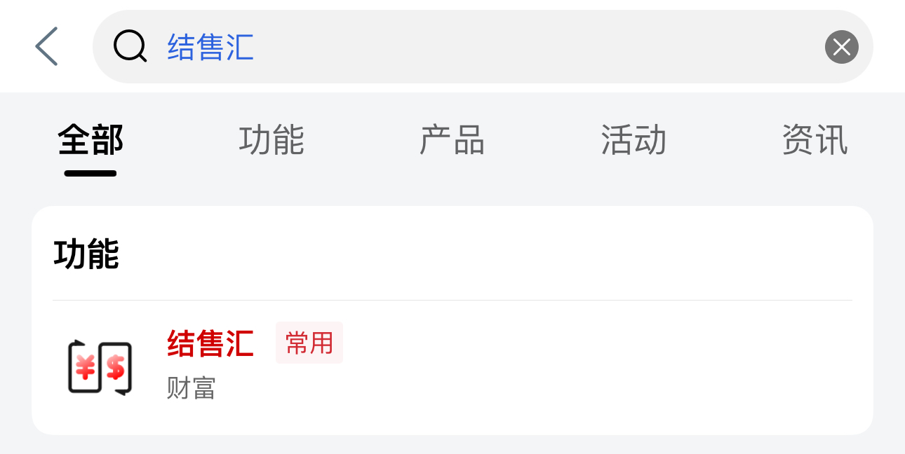

点开后我们可以直接看到第一行便是对应美元汇率，默认显示的是**购汇**汇率，显示价格为726.54，这个购汇价格指的是**依据今天的汇率，银行现在愿意以726.54元（¥726.54）的价格卖出100美元**，而我们所需要用到的购汇汇率即为**¥7.2654/$**。

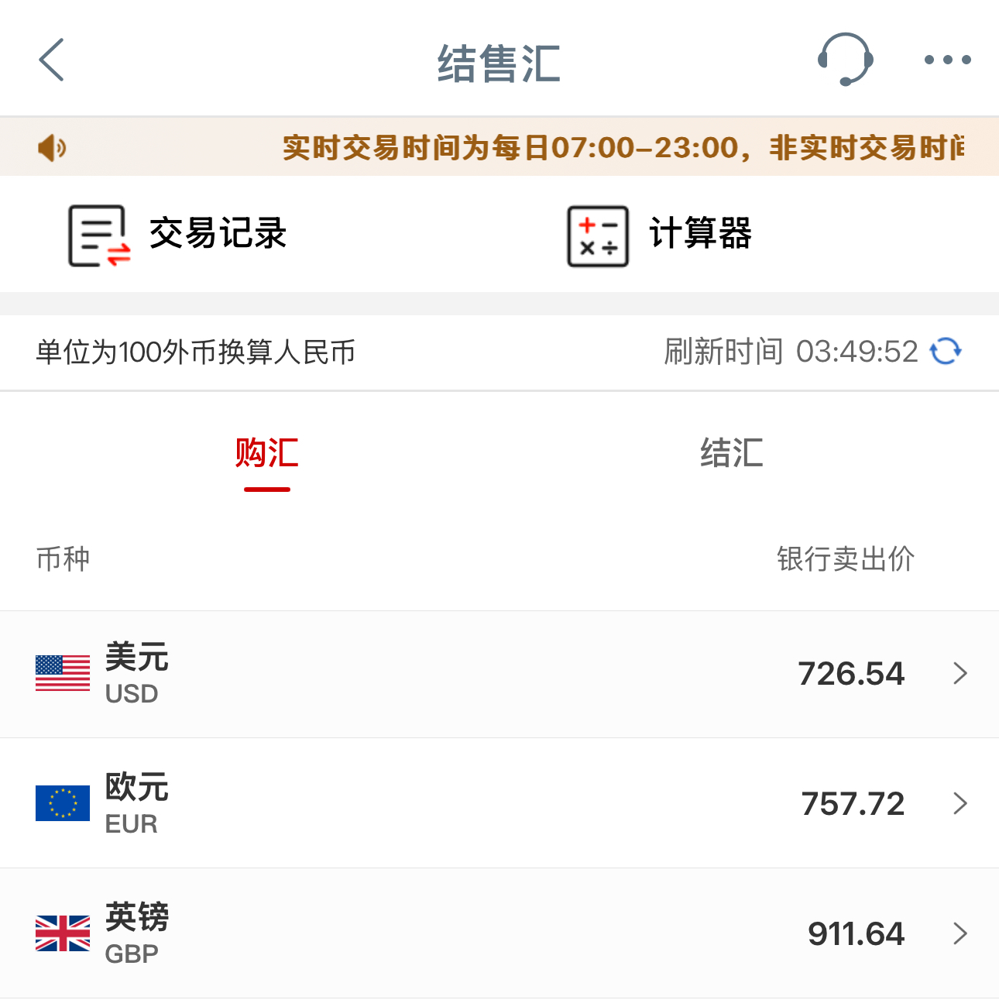

随后再点击结汇可以看到此处第一行的美元显示723.50，这个结汇价格指的是**依据今天的汇率，银行现在愿意以723.50元（¥723.50）的价格买入100美元**，而我们所需要用到的结汇汇率即为**¥7.2350/$**。

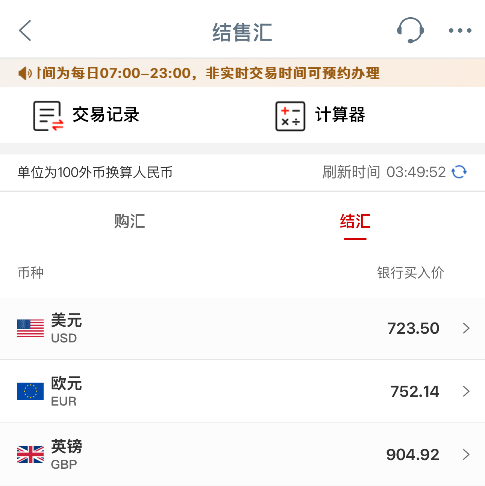

> 买是比卖的价格要高一点的。在外汇交易中，您可能会注意到银行出售外币给您的汇率（售汇汇率）通常高于银行从您手中购买外币的汇率（结汇汇率）。这种差异被称为买卖价差，它的存在有着深层的金融原因，主要涉及银行的运营成本、风险管理和盈利需求。
> 1. 交易成本与运营费用
> 
> 银行在提供外汇服务时会产生各种成本：
> * 运营成本：处理交易所需的人力、技术系统和基础设施费用；
> * 流动性成本：为了满足客户需求，银行需要持有一定数量的外币储备，这占用了资金并产生机会成本。
> 
> * 买卖价差帮助银行覆盖这些成本。通过设置略高的售汇汇率和略低的结汇汇率，银行能够在提供外汇服务的同时确保自身的盈利能力。
> 2. 市场流动性与供求关系
> 
> 汇率还受到货币对的市场流动性和供求动态的影响。交易量较小、流动性较低的货币通常会有更大的买卖价差，以补偿银行承担的额外风险和成本。
> 3. 盈利需求
> 
> 作为商业机构，银行需要通过提供服务来实现盈利。买卖价差中的一部分构成了银行的利润来源，这是金融服务行业的标准做法。
> 
> *_此段内容由AI生成_

其次，我们还需要额外两个数据：

美元三月定存年化利率与国内三月期国债利率

美元三月定存年化利率也是在工商app上可以查找得到：

回到首页，在搜索框中输入“**定期存款**”，随后点击下方跳出来的功能：

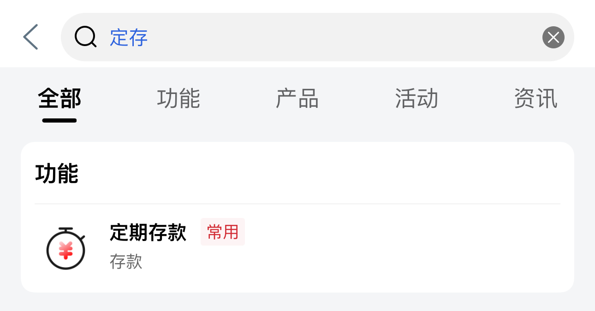

进入定期存款功能后，我们可以看到左上处有**外币**的定存币种选项，点开并选择美元：

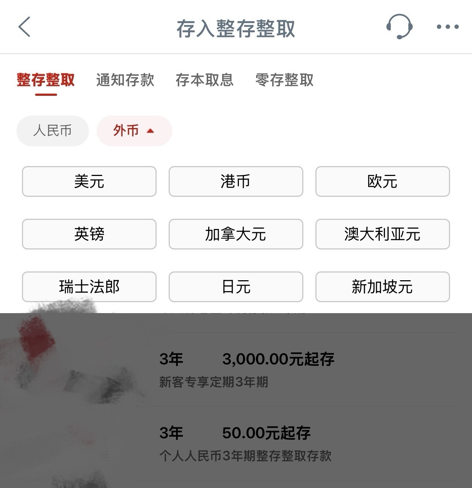

可以看到美元三月期定存年化利率为2.30%。（实际上美元定存需要去线下柜台办理，但是年化利率是和app上显示的是一样的）


下一个便是国内三月期国债利率，这个是为了计算如果未对冲的时间价值成本。

~~我在[新浪财经](https://stock.finance.sina.com.cn/forex/globalbd/gcny3.html)上找到了这个数据，感谢@新浪财经！！~~

写到最后才发现用的是三年的:( 三月国债收益率可以在[这里](https://yield.chinabond.com.cn/cbweb-cbrc-web/cbrc/showHistory?&locale=cn_ZH)查到，其实是1.3726%，文章的数据就继续用1.45%吧，懒得改了，还要重新截图重新打数字...就当作看到这篇文章的大家完成后的小测试吧/

> 中央国债登记结算有限责任公司！万分感激！

今天的三月期国债利率为1.3726%。

> 发现要改的不是很多于是还是选择改回来了。

[截图5]

至此，我们已经完成了所有前置数据的收集，以下是额外假设：

> 假设三月后预期汇率为¥7.5000/$。

## 逐步执行

首先，我们使用购汇结汇利率来计算工行当日的锚定利率是多少。取二者平均数，得出当日银行结售汇锚定利率为¥7.2502/$。


对应得出购汇溢价率为0.2096%。


以下是总图：


随后我们开始着手对冲的计算。依据案例背景，我们最终在明年一至二月份，也就是三个月后将需要$30,000美元。


依据当日银行挂牌购汇汇率（工行），我们可以计算出我们当日购汇将花费¥217,962.00人民币，购汇完成后此时我们的账户将拥有$30,000美元。


我们于同日进行定存操作，并于三月后连本带息共取得$30,171.03美元。


此时再依据预期汇率，同时考虑结售汇溢价率，计算得出到期后结汇所得人民币为¥225,808.34。

与此同时，准备在支付宝中以三个月后的实际汇率（此处假设为¥7.500/$）缴纳30,000美元。即¥225,000人民币。

通过上述三个数据，**当日购汇花费 ¥**、**定期存款到期结汇所得人民币 ¥**与**支付宝实际缴纳人民币 ¥**，我们最终可以得出对冲后的总花费。


对冲后的最终总花费为¥217,153.66人民币。

此时我们再来计算不对冲对应的花费：（就是未来贴现到今天是多少钱）

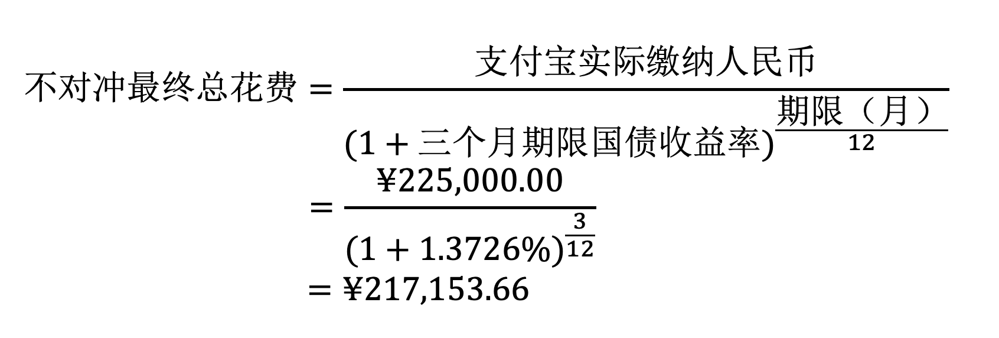

最终得出不对冲对应的花费为¥224,234.47人民币。


至此，主要计算过程已经结束，依据上述信息我们能得出，在汇率上涨至¥7.500/$后，汇率上涨导致总花费额外多出¥7,509.71人民币。在使用对冲策略后，购入美元存定期的策略带来了¥7080.81人民币的盈利，此时汇率上涨对总花费的影响减少至额外多出¥428.90人民币。由此证明对冲策略是有效的


## 但是...
> 这个对冲策略在不同汇率的时候都能有相同的效果吗？

以下是在不同汇率情况下对冲策略的效果展示：

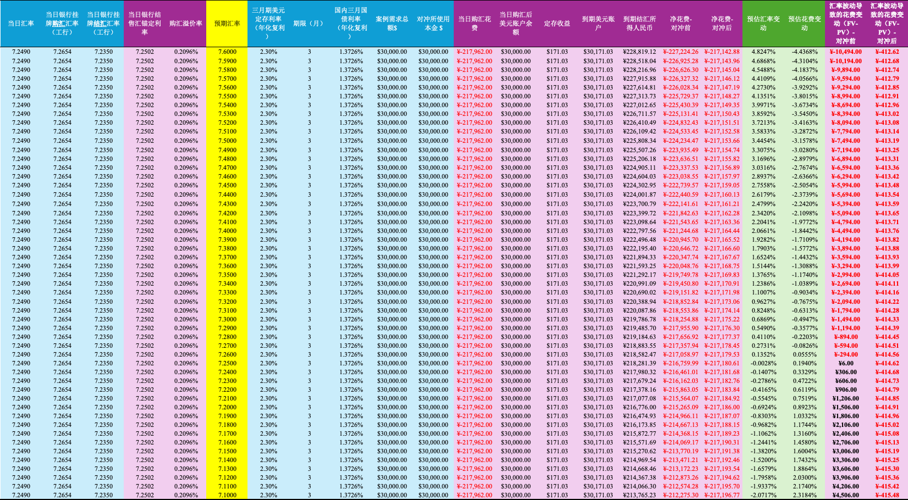

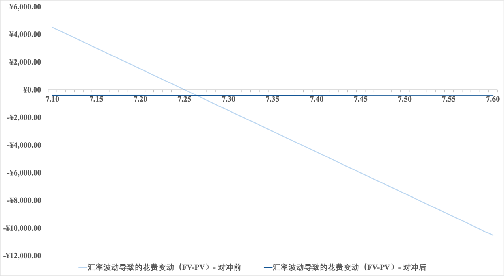

由图可见，在汇率大幅度波动情况下，该策略通过花费¥400人民币的成本（对应$30,000美元），成功的保护了头部风险。该策略的成本依然会逐渐变化的原因是结售汇带有的溢价率。

### 拓展1

> 事实上学费方面应该不用这么麻烦，因为支付宝留学缴费不是到交学费的时间才能转，而是啥时候都能转，如果是交学费多出的钱应该是会存在学生账户中，一直到下次使用。这段话的意思就是说，如果您真的担心汇率会上涨，与其搞下面这些操作来提前锁定汇率，不如现在就转到学校账户里面/
> 但是房租什么的确实是有用的！

以上都是理论讲解，在**现实生活**中，若您要采取上述策略，您应：（实际步骤还请以各大银行实际步骤为准）

先在工行手机app上进行购汇操作（其实应该哪个银行都有，不过我只用过工行的）（忘记是不是手机上就能操作了还是得去线下，不过定期必须得先下不如刚好一起办了）（购汇购钞 不用选钞 因为无需用到现金）

在购汇完毕后，前往线下进行美元定期存款流程

等待三个月至下学期学费缴纳窗口期

在美元三月定期存单到期时，进行结汇操作，同时在支付宝上找到留学缴费，填写学校对应信息，缴纳对应费用，记得支付宝好像会收取固定服务费，不过这对策略本身没有影响/

仔细算账，看一下有没有哪一步出错了

好了，这下我们完成了一次微型对冲！！

### 拓展2

如果您对未来汇率走势（如达到 ¥7.500/$）有非常强的预期，且有充足的理由相信该汇率最终会实现，那么可以利用 Excel 中的 Goal Seek (单变量求解) 功能，通过调整策略中的关键变量来找到“最佳对冲比例”。该比例对应于一种情况，即策略的最终盈亏为零，既不亏钱，也不赚钱，从而锁定一个理论上的最优方案。

当然这只是基于盈亏为0的最佳对冲比例的计算方式！还有许多不同的计算方法！


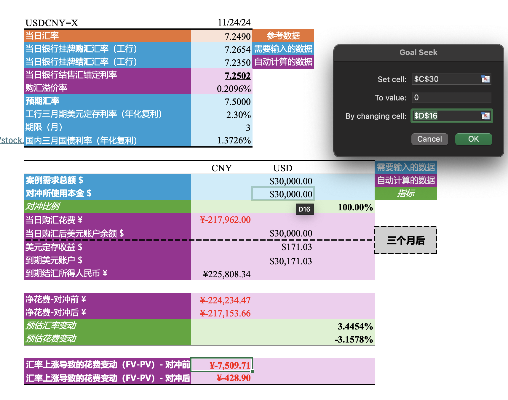

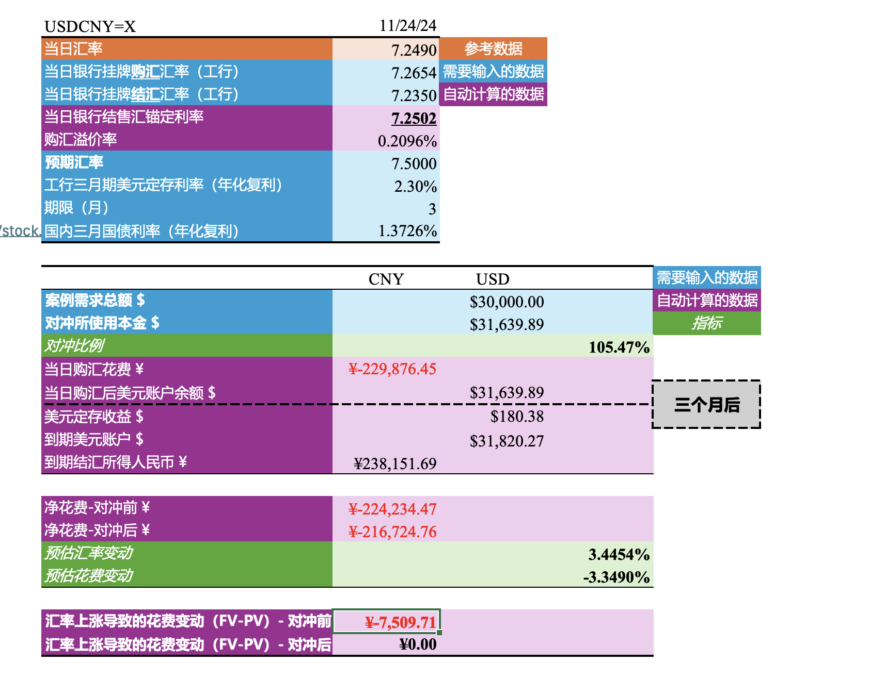

### 拓展3

如果我们希望进一步分析不同汇率条件下的对冲比例，可以使用 Excel VBA 编写代码，对多个汇率点进行循环计算。通过对每个汇率设定相同的条件（如最终盈亏为零），我们就可以找到一系列对应汇率的对冲比例拉！

通过分析多种汇率场景，可以找到变动幅度最小的对冲比例，进一步优化我们的对冲策略！

```
Sub best_hedge_percent()
    Dim i As Integer
    For i = 3 To 53
        ' 1 row to last row
        Range("AE" & i).GoalSeek Goal:=0, ChangingCell:=Range("S" & i)
    Next i
End Sub
```

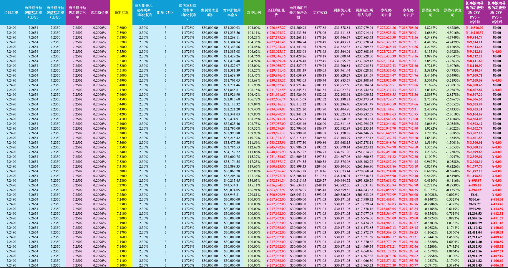

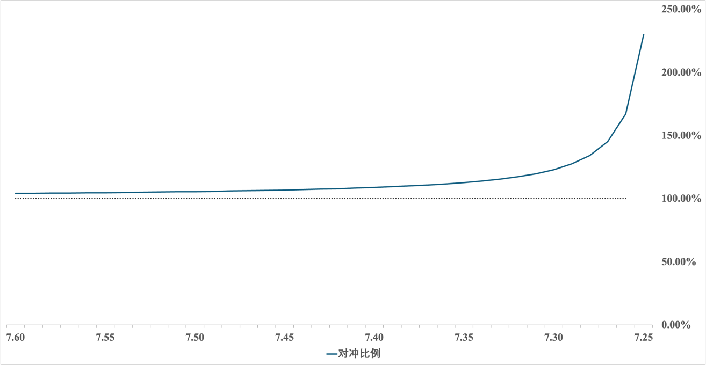

> Excel原文件请在公众号私信 “微型对冲” ！

### 声明
> _本文内容为原创，未经许可，任何个人或组织不得擅自转载、摘编或利用其它方式使用。如需转载，请联系本人或相关权利人获取授权，并注明文章来源及作者。违反上述声明者，本人将保留追究其法律责任的权利。_

> _本文内容仅供读者参考，不构成任何投资建议，也不作为任何法律法规、监管政策的依据，读者不应以该等信息作为决策依据或依赖该等信息做出法律行为，由此造成的一切后果由投资者自行承担。_
