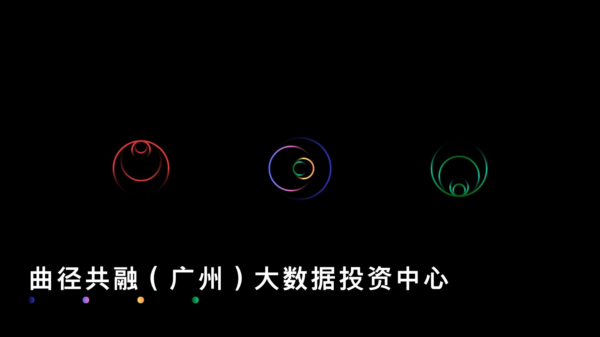

**Curveway Confluence (Guangzhou) Big Data Investment Center** was established on November 27, 2023. Headquartered in Guangzhou, Guangdong Province, it has a registered capital of RMB 188,000.

Chinese Official Name: 曲径共融（广州）大数据投资中心

Our company focuses on **data collection and analysis, economic analysis, quantitative research, and consulting**, and is committed to providing efficient and professional services to our clients.

We adhere to the philosophy “**From winding paths to harmonious convergence**,” integrating advanced big data technologies with deep industry experience to help clients discover potential opportunities in complex market environments. Through rigorous data analysis and quantitative research, we offer in-depth economic insights and strategic consulting to support our clients in achieving efficient business growth and value enhancement.

Our team is composed of passionate and creative professionals from diverse fields, including data science, economics, and finance. We continuously innovate and strive to improve service quality, working together with our clients to create a brighter future.

**Contact Email**: qjgr@huangdapao.com

