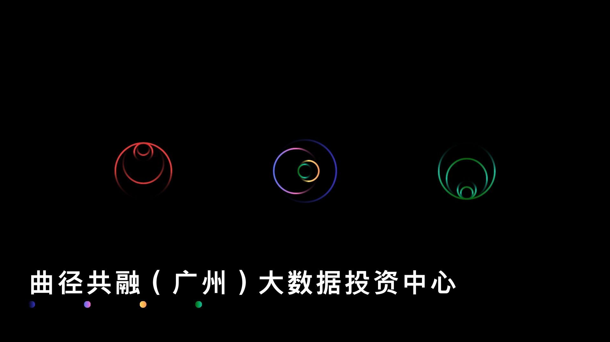

**曲径共融（广州）大数据投资中心**成立于2023年11月27日，总部位于广东省广州市，注册资本18.8万元。

外文名：Curveway Confluence (Guangzhou) Big Data Investment Center

我司专注于**数据收集与分析、经济分析、量化研究与咨询**等领域，致力于为客户提供高效、专业的服务。

我司秉持“**源于曲径、终于共融**”的理念，融合先进的大数据技术和深厚的行业经验，帮助客户在复杂的市场环境中发现潜在机会。并通过严谨的数据分析与量化研究为客户提供深入的经济洞察和战略咨询，助力其实现高效业务增长和价值提升。

我们的团队由一群富有激情和创造力的专业人士组成，涵盖数据科学、经济学、金融学等多个领域。我们将持续创新，不断提升服务质量，与客户携手共进，共创美好未来。

